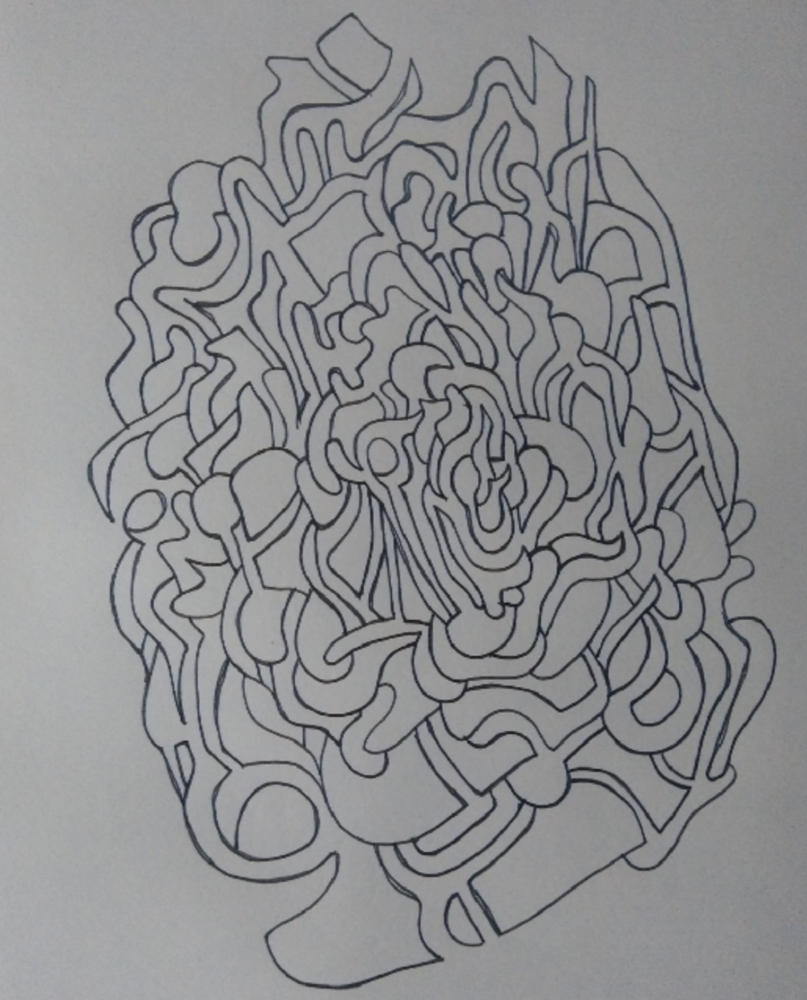
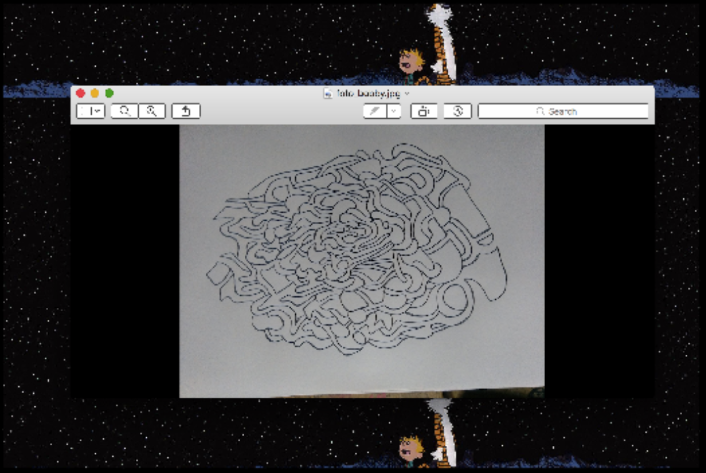
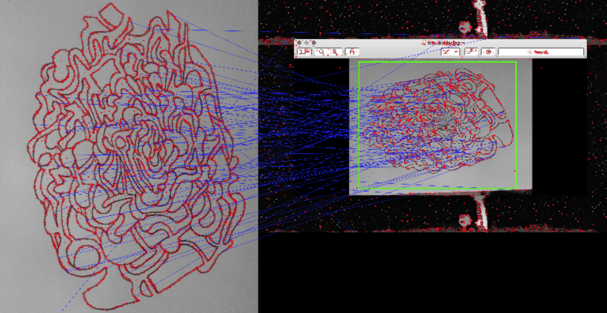
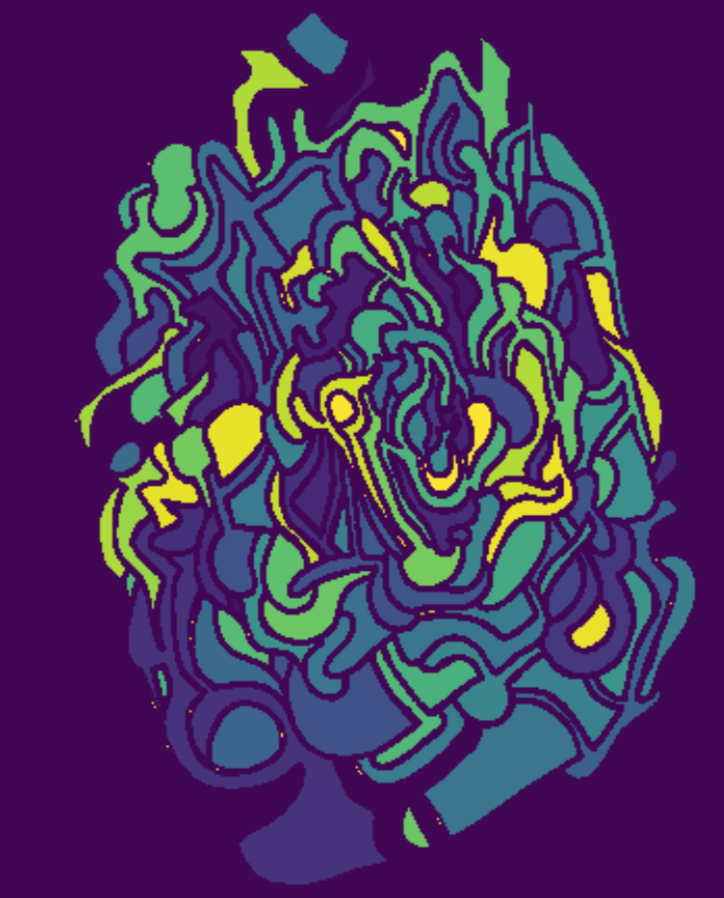
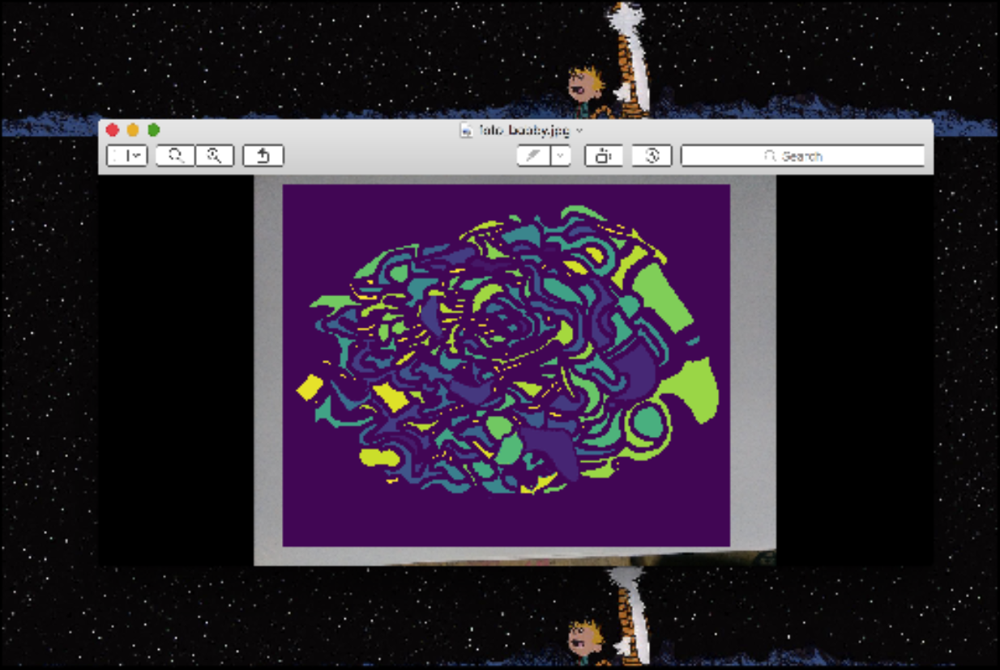

The first fruit that has been born from image explorations, a project that
started long ago to try and see what could be done with images. This code was
the main ingredient for an animation project for a Gender, Race and Social
Justice course. The project tried to speak out on the illusory nature of our
perceptions, preconceptions, assumptions, judgementalities and the likes,
especially those related to Gender, Race and Social Justice.

The process is simple. A directory holding images and a storing directory are
provided in the code, in addition to a single image of the object that must be
found and "animated".

The images are analyzed with the intent of finding the object using SIFT
features.

After finding the desired object in each of the singular images, it will search
for blobs of varying sizes and shapes using a Laplassian of Gaussian method.

Each of this blobs is abstracted to stand on its own, i.e. in a separate image,
everything that is not the blob is made a single color.

  

Then, each of these "blob images" are transformed in various ways e.g. rotated,
shrunk, etc. and the image is stiched back together with the modified object
in it.

Option to make gifs, and videos are pausible, but at the moment the video option
does not function as expected.

The video I created for the class is available upon request.

